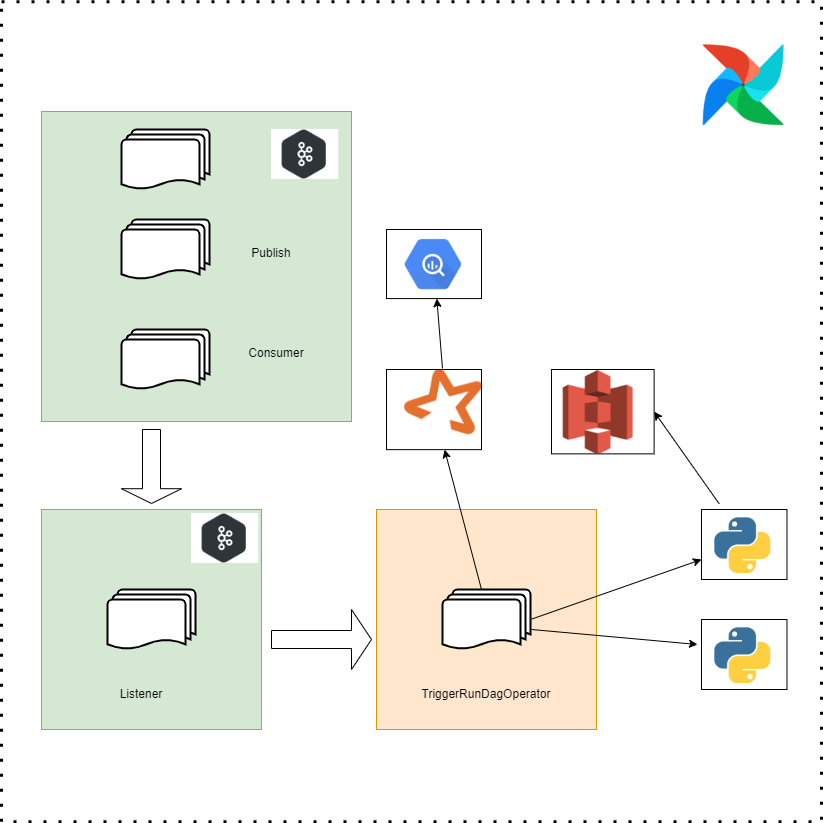

# `DEMO PROJECT for SPARK, AIRFLOW and KAFKA`

# `How it works in local`

    Open Docker Desktop

    cd airflow
    astro dev start

    cd spark/notebooks/university
    docker build -t lc-app .

    Under dags/kafka_pub_sub.py add array of countries ex: ["Canada", "France"]

    In localhost:8080 unpause dags

    Wait for the stream_listener to be deffered status

    Run kafka_university
